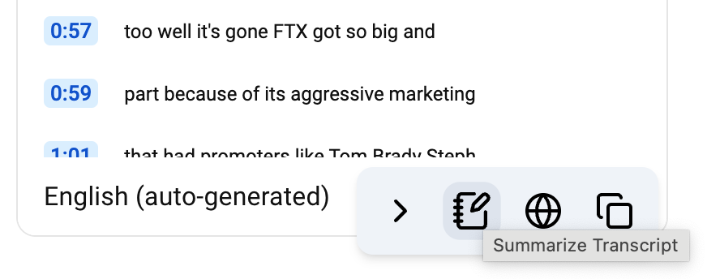
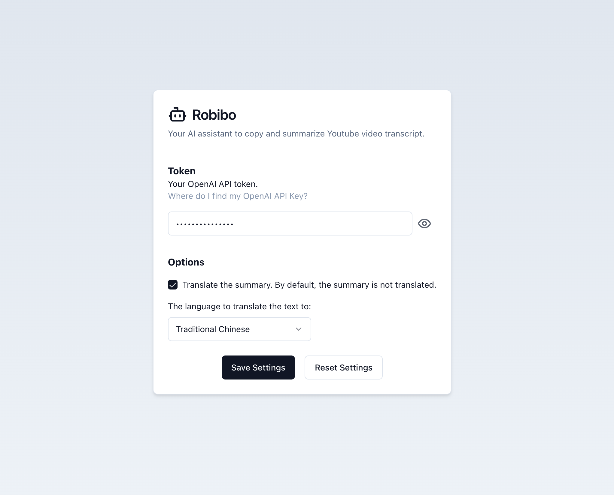

<!-- PROJECT SHIELDS -->
<!--
*** I'm using markdown "reference style" links for readability.
*** Reference links are enclosed in brackets [ ] instead of parentheses ( ).
*** See the bottom of this document for the declaration of the reference variables
*** for contributors-url, forks-url, etc. This is an optional, concise syntax you may use.
*** https://www.markdownguide.org/basic-syntax/#reference-style-links
-->

# Robibo

[![Contributors][contributors-shield]][contributors-url]
[![Forks][forks-shield]][forks-url]
[![Stargazers][stars-shield]][stars-url]
[![Issues][issues-shield]][issues-url]
[![MIT License][license-shield]][license-url]
[![LinkedIn][linkedin-shield]][linkedin-url]

- [Robibo](#robibo)
  - [Introduction](#introduction)
    - [Features](#features)
    - [Built With](#built-with)
  - [Getting Started](#getting-started)
    - [Prerequisites](#prerequisites)
    - [Installation](#installation)
  - [Usage](#usage)
  - [License](#license)
  - [Contact](#contact)

## Introduction

I watch a lot Youtube videos everyday, especially reviews of food, technology and gadgets. Often, I just want to grasp the essence of the video without watching the whole thing. I also like to copy the transcript of the video to take notes. So I built Robibo to help me with that.

### Features


Robibo is a extension that help to summarize and copy transcript from a Youtube video.

- Copy transcript of a youtube video to clipboard
- Summarize (and translate) transcript with OpenAI API

### Built With

[![Plasmo][Plasmo]][Plasmo-url]
[![Tailwind][Tailwind]][Tailwind-url]

## Getting Started

This is a chrome extension built with Plasmo. It is not published on the Chrome Web Store yet, but you can run the extension in development mode by following these steps:

### Prerequisites

You will need to have node.js installed on your machine. You can download it [here](https://nodejs.org/).

### Installation

1. Clone this repo to your local machine:

   ```bash
   git clone https://github.com/jackplus-xyz/robibo.git
   ```

2. Navigate to the project directory:

   ```bash
   cd robibo
   ```

3. Install the dependencies:

   ```bash
   pnpm install
   # or
   npm install
   ```

4. Then, run the development server:

   ```bash
   pnpm dev
   # or
   npm run dev
   ```

5. Open your browser and load the appropriate development build. For example, if you are developing for the chrome browser, using manifest v3, use: `build/chrome-mv3-dev`.

For further guidance, [visit the Plasmo Documentation](https://docs.plasmo.com/)

## Usage

The extension will be loaded automatically when you open a Youtube video. It will add a floating menu on the bottom right corner of the page. If you don't see the menu, try refreshing the page. You can click the buttons to:

- Toggle the floating menu
- Summarize the transcript
- Summarize and translate the transcript
- Copy the transcript



To use the summary feature, you will need to have an OpenAI API key. You can get one [here](https://platform.openai.com/). Then click the extension icon or open the options page to enter your API key. You can also change the language for translation. By default, the language is set to English.



<!-- LICENSE -->

## License

Distributed under the MIT License. See `LICENSE.txt` for more information.

<!-- CONTACT -->

## Contact

Jack Huang - [@jackplusxyz](https://twitter.com/jackplusxyz) - <hello@jackplus.xyz>

Project Link: [https://github.com/jackplus-xyz/robibo](https://github.com/jackplus-xyz/robibo)

<!-- MARKDOWN LINKS & IMAGES -->
<!-- https://www.markdownguide.org/basic-syntax/#reference-style-links -->

[contributors-shield]: https://img.shields.io/github/contributors/jackplus-xyz/robibo.svg?style=for-the-badge
[contributors-url]: https://github.com/jackplus-xyz/robibo/graphs/contributors
[forks-shield]: https://img.shields.io/github/forks/jackplus-xyz/robibo.svg?style=for-the-badge
[forks-url]: https://github.com/jackplus-xyz/robibo/network/members
[stars-shield]: https://img.shields.io/github/stars/jackplus-xyz/robibo.svg?style=for-the-badge
[stars-url]: https://github.com/jackplus-xyz/robibo/stargazers
[issues-shield]: https://img.shields.io/github/issues/jackplus-xyz/robibo.svg?style=for-the-badge
[issues-url]: https://github.com/jackplus-xyz/robibo/issues
[license-shield]: https://img.shields.io/github/license/jackplus-xyz/robibo.svg?style=for-the-badge
[license-url]: https://github.com/jackplus-xyz/robibo/blob/master/LICENSE.txt
[linkedin-shield]: https://img.shields.io/badge/-LinkedIn-black.svg?style=for-the-badge&logo=linkedin&colorB=555
[linkedin-url]: https://www.linkedin.com/in/jackplus-xyz/
[product-screenshot]: images/screenshot.png
[Plasmo]: https://img.shields.io/badge/plasmo-6E56CF?style=for-the-badge
[Plasmo-url]: https://plasmo.com/
[Tailwind]: https://img.shields.io/badge/tailwind%20css-06B6D4?style=for-the-badge&logo=tailwindcss&logoColor=white
[Tailwind-url]: https://tailwindcss.com/
